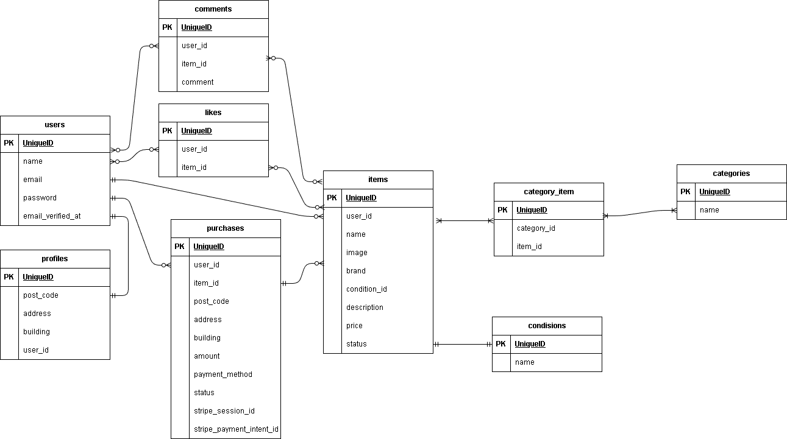

#アプリケーション名

coachtechフリマ

## 環境構築

git clone git@github.com:WDRNT/test-mogitate.git/
cp .env.example .env
docker-compose up -d --build
docker-compose exec php bash
composer install
php artisan key:generate
php artisan migrate --seed
php artisan storage:link

## 使用技術

PHP 8.X
Laravel 8.1
nginx:1.21.1
MySQL
Docker
Stripe
Laravel Fortify
Mailhog

## 認証

Laravel Fortifyを使用

## メール認証

Mailhogを使用

http://localhost:8025

## Stripe設定

Stripeを使用して決済機能を実装しています。

Stripeアカウントを作成し、以下のキーを `.env` に設定してください。

STRIPE_PUBLIC_KEY=
STRIPE_SECRET_KEY=
STRIPE_WEBHOOK_SECRET=

## Webhook

Stripe CLIを使用してWebhookを設定

stripe listen --forward-to localhost/webhook

## URL
開発環境: http://localhost/

## ER図

